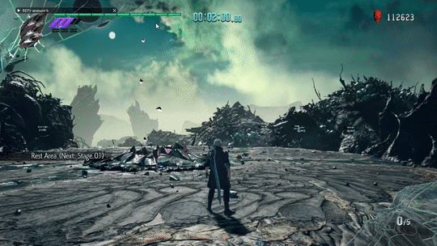

<!-- PROJECT LOGO -->
<br />
<p align="center">
  <a href="https://github.com/muhopensores/dmc5perfmod/">
    
  </a>

  <h3 align="center">DMC5 Performance mod</h3>

  <p align="center">
    A bunch of graphic mods for DMC5 to make the game run better on old hardware.
    <br />
    <a href="https://github.com/muhopensores/dmc5perfmod/releases"><strong>Download »</strong></a>
    <br />
    <br />
    <a href="https://github.com/muhopensores/dmc5perfmod/issues">Report Bugs</a>
    ·
    <a href="https://github.com/muhopensores/dmc5perfmod/pulls">Send a Pull Request</a>
  </p>
</p>

<!-- TABLE OF CONTENTS -->
## Table of Contents
* [About the Project](#about-the-project)
  * [Built With](#built-with)
* [Downloading](#downloading)
* [Installation](#installation)
* [Settings](#settings)
* [Uninstalling](#uninstalling)
* [Building](#building)
  * [ICL Notes](#icl-notes)
  * [Clang Notes](#clang-notes)

<!-- ABOUT THE PROJECT -->
## About The Project
<br />
<p align="center">
    
</p>
<br />

Devil May Cry 5 graphic mods for low spec PCs. Those include:
* Disabling Light Probes
* LOD override (make the game always use lowest quality models possible)
* Disabling Shadows
* Disabling Ambient Occlusion
* Disabling Cubemaps
* Disabling Atmospheric haze (refered as Fog by the game but it's not the case(?))
* Disabling IBL (removes the sky and ambient lighting(?))

### Built With
* [REFramework](https://github.com/praydog/RE2-Mod-Framework)
* [Hacklib](https://bitbucket.org/rafzi/hacklib/src/master/)
* [mINI](https://github.com/pulzed/mINI)

<!--USER GUIDE -->
## Downloading
Grab latest release.zip from [Releases](https://github.com/muhopensores/dmc5perfmod/releases) tab.

## Installation
Place `MFReadWrite.dll` and `performance.ini` into the root of your game folder (where DevilMayCry5.exe is located). For example: 
```
C:\Program Files (x86)\Steam\steamapps\common\Devil May Cry 5\
```

## Settings
Can be toggled in `performance.ini` file or at runtime, but be aware that disabling something, then enabling it back will not work until a level reload (restart from checkpoint for example).
```
CTRL + F1 - Toggle Light Probes.  
CTRL + F2 - Toggle LOD overwrite.  
CTRL + F3 - Toggle Shadows.  
CTRL + F4 - Toggle AO.  
CTRL + F5 - Toggle Cubemaps.  
CTRL + F6 - Toggle Fog.  
CTRL + F7 - Toggle IBL.
```

Example `performance.ini` that enables all the mods except fog:
```
[options]
disable_probes = 1
disable_lods = 1 #makes dynamic models lowest level of detail possible
disable_shadows = 1
disable_cubemaps = 1
disable_fog = 0 #not disabling fog by default because it barely affects performance
disable_ibl = 1
```

## Uninstalling
Remove `MFReadWrite.dll`, `performance.ini` from the game directory.

## Building
Building requires [CMake](https://cmake.org/download/) (sorry). Can be built with either Intel Compiler or Clang 10.0 rc1 (at the time https://llvm.org/builds/).

### ICL notes
Just run gen_vs2017_icl.bat and edit `-G` and/or possibly `-T` parameters passed to cmake to your corresponding VS and ICL versions if needed.

### Clang notes
To build with clang on Visual Studio 2017 you will need to install [LLVM extension](https://marketplace.visualstudio.com/items?itemName=LLVMExtensions.llvm-toolchain).  
VS 2019 claims to support LLVM toolchain out of the box (not tested).  
Then execute `gen_vs2017_clang.bat` (adjusting `-G` parameter to your VS version if needed).